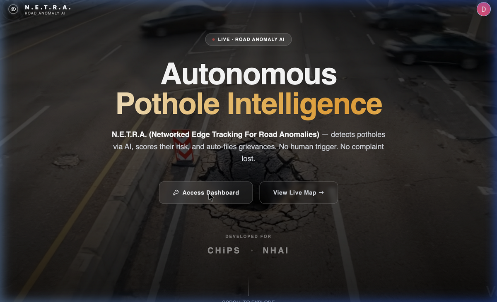

# N.E.T.R.A. 🛰️
**Networked Edge Tracking for Road Anomalies**



N.E.T.R.A. is an advanced, AI-powered system designed for **autonomous pothole intelligence**. It actively detects road anomalies using state-of-the-art computer vision algorithms, scores their severity and risk, and automatically triggers actionable workflows—such as filing grievances with relevant authorities without human intervention.

Built for organizations like CHiPS and NHAI (National Highways Authority of India), N.E.T.R.A. ensures smoother, safer roads by automating the traditionally manual process of road quality assessment.

---

## 🎯 Key Features

- **Real-Time Anomaly Detection:** Utilizes YOLOv8 for high-precision, real-time segmentation and detection of potholes from dashcam or standard video feeds.
- **Risk & Severity Scoring:** Evaluates the danger of a detected anomaly based on estimated depth and dimension (employing models like MiDaS).
- **Automated Grievance Filing:** Integrates with systems like CPGRAMS to autonomously file complaints to governmental road authorities.
- **Interactive Geospatial Dashboard:** Live mapping of detected road anomalies using Leaflet, complete with heatmaps and severity triaging.
- **Microservices Architecture:** Fully decoupled AI inference engine, Node.js backend, and a modern React frontend.

---

## 🏗️ Architecture

N.E.T.R.A. is split into three core microservices:

1. **`netra-web` (Frontend):** 
   - A lightning-fast Vite + React SPA.
   - Styled with TailwindCSS and Shadcn/UI for a premium, modern aesthetic.
   - User authentication powered by Clerk.
   - Interactive maps via React-Leaflet.

2. **`netra-api` (Backend API):** 
   - Node.js & Express server.
   - Manages CRUD operations, business logic, and communication with MongoDB Atlas.
   - Acts as the central hub routing requests between the frontend and the AI service.

3. **`NETRA-AI` (Inference Service):** 
   - Python + FastAPI application.
   - Runs PyTorch and Ultralytics YOLOv8 models.
   - Asynchronously processes incoming video/image payloads, determines geolocation, runs inferences, and synchronizes the resultant data back to the `netra-api`.

---

## 🚀 Getting Started

### Prerequisites
- Node.js (v18+)
- Python (3.10+)
- MongoDB Atlas Account / Local MongoDB
- Docker (Optional, for containerized deployments)

### Quick Start (Dockerized)

The easiest way to get the entire platform running locally is via Docker Compose:

```bash
# Clone the repository
git clone https://github.com/your-username/NETRA.git
cd NETRA

# Start all services (Frontend, API, and AI Engine)
docker-compose up --build
```
> **Note:** Ensure your `.env` files for `netra-api` and `netra-web` are properly configured before running Docker Compose.

### Manual Setup (Local Development)

#### 1. Setup Data API (`netra-api`)
```bash
cd netra-api
npm install
# Set up your .env file with MONGO_URI, PORT
npm run dev
```

#### 2. Setup AI Pipeline (`NETRA-AI`)
```bash
cd NETRA-AI
python3 -m venv .venv
source .venv/bin/activate
pip install -r requirements.txt
# Set up your env variables
uvicorn ai_service:app --host 0.0.0.0 --port 8000
```

#### 3. Setup Frontend Dashboard (`netra-web`)
```bash
cd netra-web
npm install
# Set up your .env (VITE_API_URL, CLERK keys, etc.)
npm run dev
```

---

## 🌐 Deployment Configuration (Render)

When deploying to cloud platforms like **Render**, ensure the Cross-Origin and Cross-Container network configs are accurately mapped:

- Define `AI_SERVICE_URL` in `netra-api` to point to the deployed `NETRA-AI` URL.
- Define `PUBLIC_API_ORIGIN` in `netra-api`, allowing the AI service to communicate results back to the database.
- Define `INTERNAL_API_URL` in `NETRA-AI` to point back to your public API origin setup.

---

## 🛡️ License

This project is proprietary and built for specific governmental implementation (CHiPS / NHAI). Unauthorized replication or distribution outside permitted boundaries is prohibited.
